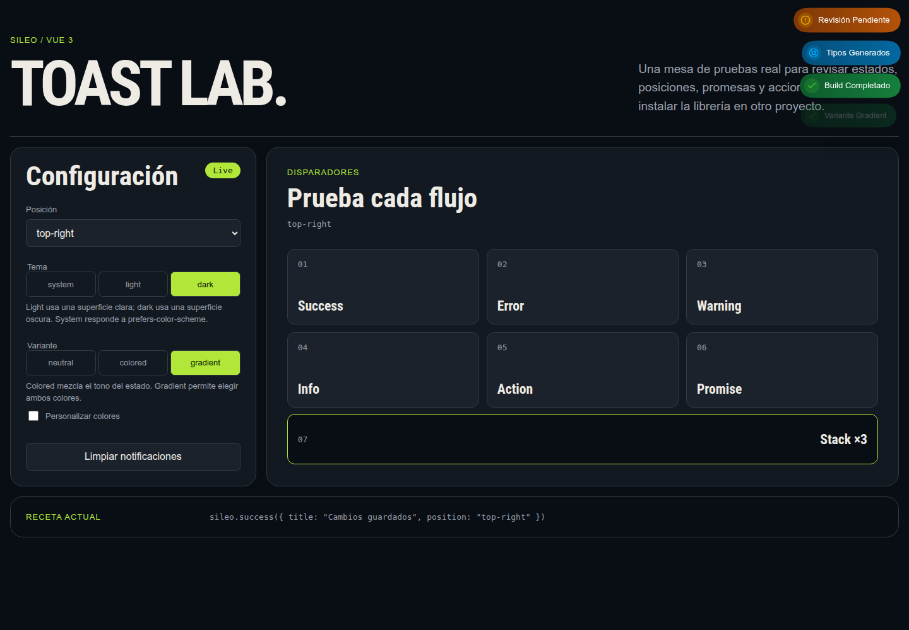

# Sileo Vue

Notificaciones toast con animaciones físicas para Vue 3. La librería conserva
la API imperativa de Sileo y ofrece un componente `Toaster` reutilizable.

> Este proyecto usa como ejemplo y referencia el proyecto abierto
> [hiaaryan/sileo](https://github.com/hiaaryan/sileo), originalmente creado para
> React. Esta adaptación para Vue es independiente y no es una versión oficial
> del proyecto original. Consulta [THIRD_PARTY_NOTICES.md](THIRD_PARTY_NOTICES.md).

## Requisitos

- Node.js 22 o superior.
- pnpm 10 o superior.
- Vue 3.5 o superior. El desarrollo usa Vue 3.5.41, la última versión publicada
  al preparar esta adaptación.

## Demo interactiva

Prueba la demo publicada en
[danixts.github.io/sileo-vue](https://danixts.github.io/sileo-vue/) o ejecútala
localmente:



```bash
pnpm install
pnpm playground
```

Abre `http://localhost:5173` para probar todos los estados, cambiar posición y
tema, ejecutar una promesa, mostrar varias notificaciones y limpiar el viewport.

## Instalación desde GitHub Packages

El paquete se publica desde
[`danixts/sileo-vue`](https://github.com/danixts/sileo-vue), por lo que usa el
scope `@danixts`.

Crea o actualiza `.npmrc` en la aplicación consumidora:

```ini
@danixts:registry=https://npm.pkg.github.com
//npm.pkg.github.com/:_authToken=${GITHUB_PACKAGES_TOKEN}
```

El token necesita el permiso `read:packages`. Después instala la dependencia:

```bash
pnpm add @danixts/sileo-vue
```

GitHub Packages solicita autenticación también al descargar paquetes públicos.
Si prefieres una instalación pública sin configurar un token, instala el
tarball adjunto al release:

```bash
pnpm add https://github.com/danixts/sileo-vue/releases/download/v0.1.0/danixts-sileo-vue-0.1.0.tgz
```

## Uso básico

Monta un único `Toaster` cerca de la raíz de la aplicación:

```vue
<script setup lang="ts">
import { Toaster } from "@danixts/sileo-vue";
import "@danixts/sileo-vue/styles.css";
</script>

<template>
  <Toaster position="top-right" theme="system" />
  <RouterView />
</template>
```

Invoca los toast desde componentes, stores o servicios:

```ts
import { sileo } from "@danixts/sileo-vue";

sileo.success({
  title: "Cambios guardados",
  description: "La configuración ya está disponible.",
});
```

Cada toast usa `sileo-default` si no se proporciona un `id`. Esto permite
reemplazar el toast actual en vez de acumular notificaciones. Usa identificadores
distintos cuando necesites mostrar varias a la vez:

```ts
sileo.info({ id: "sync", title: "Sincronizando" });
sileo.warning({ id: "quota", title: "Límite cercano" });
```

## Promesas

```ts
await sileo.promise(saveProfile(), {
  loading: { title: "Guardando", description: "Espera un momento" },
  success: (profile) => ({ title: `Perfil ${profile.name} guardado` }),
  error: (error) => ({
    title: "No se pudo guardar",
    description: String(error),
  }),
});
```

La promesa original se devuelve sin ocultar sus errores, por lo que el código
consumidor debe seguir manejando el rechazo con `try/catch`.

## Opciones globales

```vue
<Toaster
  position="bottom-right"
  :offset="{ bottom: 24, right: 24 }"
  :options="{ duration: 5000, roundness: 14, autopilot: true }"
  theme="system"
/>
```

Las opciones por toast sobrescriben las opciones globales. `styles` se combina
por clave para permitir clases personalizadas de título, descripción, badge y
botón.

## Temas

`Toaster` soporta tres modos:

- `light`: superficie clara con texto oscuro.
- `dark`: superficie oscura con texto claro.
- `system`: escucha `prefers-color-scheme` y se actualiza automáticamente.

```vue
<Toaster theme="system" />
```

Los colores del tema se pueden integrar con los tokens de cada aplicación sin
modificar la librería:

```css
[data-sileo-viewport][data-theme="light"] {
  --sileo-surface: var(--color-surface);
  --sileo-content-color: var(--color-text-muted);
}

[data-sileo-viewport][data-theme="dark"] {
  --sileo-surface: var(--color-surface-inverse);
  --sileo-content-color: var(--color-text-inverse-muted);
}
```

El `fill` configurado directamente en un toast siempre tiene prioridad sobre el
tema global.

### Variantes de superficie

Las variantes pueden configurarse globalmente o por toast:

- `neutral`: usa la superficie del tema.
- `colored`: mezcla el color del estado con la superficie del tema.
- `gradient`: usa un gradiente SVG que mantiene la animación gooey original.

`gradient` incluye presets distintos para `success`, `loading`, `error`,
`warning`, `info` y `action`. Cada estado tiene colores adaptados para los
temas `light` y `dark`, por lo que no es necesario configurar colores para el
caso común:

```vue
<Toaster theme="system" :options="{ variant: 'gradient' }" />
```

Los colores se pueden sobrescribir globalmente o por toast. Se acepta cualquier
color CSS válido, incluyendo HEX, `rgb()`, `rgba()`, `oklch()` y variables CSS.

```vue
<Toaster
  theme="system"
  :options="{
    variant: 'gradient',
    gradient: { from: '#7c3aed', to: '#06b6d4' },
  }"
/>
```

```ts
sileo.error({
  title: "No se pudo conectar",
  variant: "gradient",
  gradient: {
    from: "#ff006e",
    to: "#3a86ff",
  },
});
```

Con variables generadas por Tailwind CSS v4:

```ts
sileo.info({
  title: "Nueva versión",
  variant: "gradient",
  gradient: {
    from: "var(--color-violet-600)",
    to: "var(--color-cyan-500)",
  },
});
```

También puede usarse RGBA:

```ts
gradient: {
  from: "rgba(124, 58, 237, 0.95)",
  to: "rgba(6, 182, 212, 0.9)",
}
```

También se pueden definir colores predeterminados desde el proyecto consumidor:

```css
[data-sileo-viewport] {
  --sileo-gradient-from: #7c3aed;
  --sileo-gradient-to: #06b6d4;
}
```

Para modificar solamente un estado:

```css
[data-sileo-viewport] {
  --sileo-gradient-success-from: var(--color-emerald-700);
  --sileo-gradient-success-to: var(--color-emerald-400);
  --sileo-gradient-error-from: rgba(127, 29, 29, 0.96);
  --sileo-gradient-error-to: #ef4444;
}
```

La prioridad es: `gradient.from/to` del toast, variables globales
`--sileo-gradient-from/to`, variables específicas del estado y finalmente el
preset light/dark incluido en la librería.

Los cambios de color conservan el filtro gooey de Sileo y se animan sin alterar
la opacidad del texto durante hover.

## API

- `sileo.show(options)`
- `sileo.success(options)`
- `sileo.error(options)`
- `sileo.warning(options)`
- `sileo.info(options)`
- `sileo.action(options)`
- `sileo.promise(promiseOrFactory, options)`
- `sileo.dismiss(id)`
- `sileo.clear(position?)`

## Desarrollo

```bash
corepack enable
pnpm install
pnpm playground
pnpm lint
pnpm typecheck
pnpm test
pnpm build
pnpm verify:package
pnpm pack --dry-run
```

## Publicación

Los workflows del repositorio:

- `ci.yml` valida lint, tipos, pruebas, paquete y playground en cada cambio.
- `pages.yml` publica el playground en GitHub Pages desde `main`.
- `publish.yml` publica el paquete en GitHub Packages y adjunta un tarball
  instalable públicamente cuando se publica un GitHub Release.

Antes de cada release:

1. Confirma el scope y la URL del repositorio en `package.json`.
2. Actualiza la versión con `pnpm version patch`, `minor` o `major`.
3. Crea el tag y el GitHub Release correspondiente.

Los workflows usan Node.js 22, pnpm y permisos mínimos de `GITHUB_TOKEN` para
Pages, Releases y GitHub Packages.
